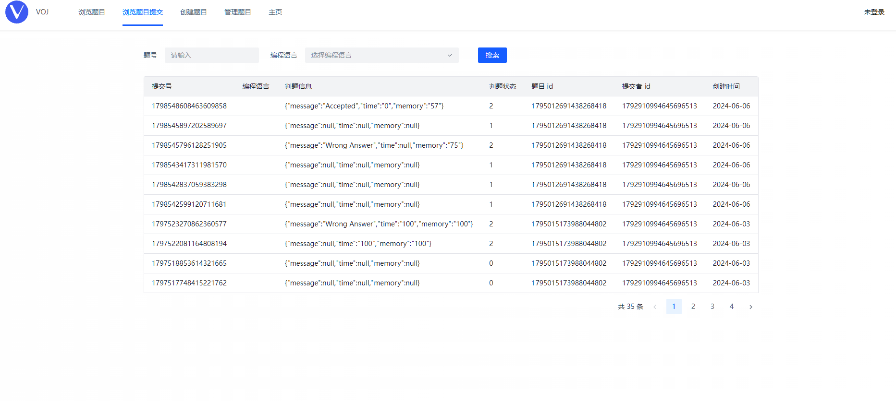
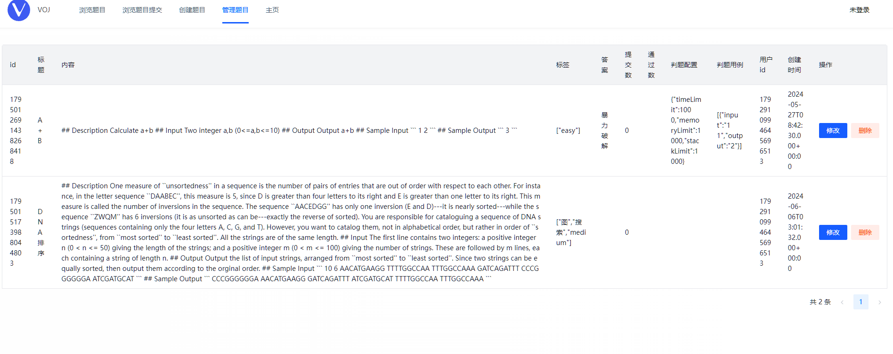
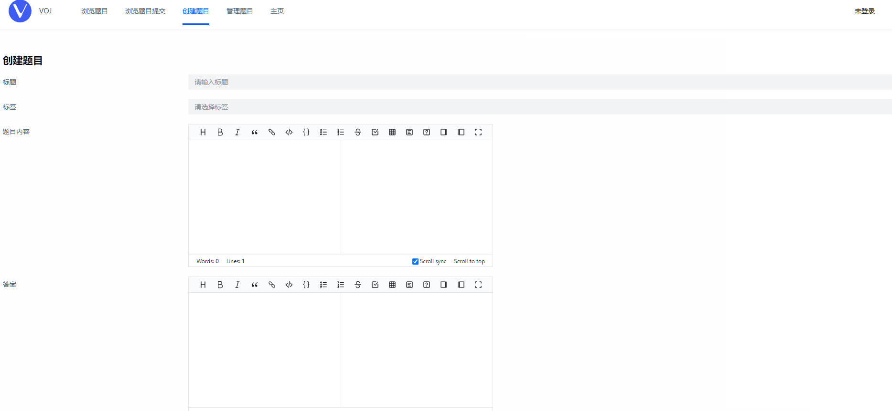

# VOJ在线判题系统

## 项目简介

VOJ在线判题系统是一个高性能、易扩展的编程题目在线评测系统，专为编程爱好者、教育机构和竞赛组织设计。该系统基于Vue 3前端框架、Spring Boot以及Docker容器化部署技术，实现了高效、稳定、安全的在线编程评测体验。
同时，也提供基于Spring Cloud的[后端微服务架构版本](https://github.com/Vampon/voj-backend-microservice)
**核心功能**：

1. **题目管理**：管理员可以轻松创建、编辑、删除和发布各类编程题目，支持多种编程语言。
2. **用户交互**：用户可自由浏览题目列表，搜索感兴趣的题目，阅读题目描述和样例输入输出，并在线编写、提交代码。
3. **代码评测**：系统后端采用代码沙箱技术，能够在安全隔离的环境中编译、运行用户提交的代码，并根据预设的测试用例自动判断输出是否正确，提供即时反馈。
4. **独立沙箱服务**：代码沙箱模块作为独立服务，不仅服务于VOJ系统本身，还可供其他开发者集成使用，为其他项目提供安全的代码执行环境。
5. **性能优化**：利用微服务架构的优势，系统具备高度的可扩展性和容错性，能够应对高并发、大数据量的评测需求。

## 目录结构 

| 模块             | 模块说明     |
| ---------------- | ------------ |
| voj-backend      | 后端服务模块 |
| voj-frontend     | 前端界面     |
| voj-code-sandbox | 代码沙箱模块 |

## 功能展示

### 题目页面

### 在线做题界面

### 题目提交界面

### 题目管理

### 创建题目

